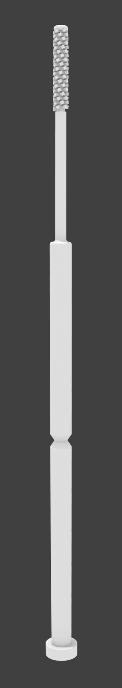

# OpenSwab - Nasopharyngeal (NP) Swab for COVID-19

[![CC BY-SA 4.0][cc-by-sa-shield]][cc-by-sa]

[Spanish Version](README.md)

## About



OpenSwab is a prototype of a Nasopharyngeal (NP) swab used to collect samples
for COVID-19 testing.

It is a thin, flexible swab, which is inserted into the nasal cavity parallel
to the bottom of the nostril until the head of the swab touches the wall of the
nasopharynx. Upon reaching the wall, small rotations are carried out so that
the swab head collects the biological material required to proceed with the
COVID-19 test.

The swabs used for COVID-19 tests cannot be made of materials such as cotton or
wood, since they affect the RNA (Ribonucleic Acid) of the sample taken.

Because of the precision and accuracy required this swab is expected to be
printed by a SLA 3D printer using biocompatible resin.

Due to the precision and accuracy required, this swab is designed to be printed
on a SLA (Stereolithography) 3D printer using heat resistant biocompatible
Class I (short-term use) ultra-violet (UV) curing resin for subsequent
sterilization in an autoclave.

At the time of this writing there is a global shortage of personal protection
equipment (PPE) and other medical supplies, including testing swabs. This swab
was designed and created in a effort to provide a possible solution to this
problem.

The intellectual property of this design is under a [CC BY-SA 4.0][cc-by-sa]
international license, so it can be used, manufactured, reproduced, modified
and commercialized freely. You can refer to the license section or contact the
OpenSwab team for more information.

This prototype is currently being reviewed by health authorities along many
other designs. Nevertheless, it hasn't been tested, validated or approved by
any organization.

<br clear="right"/>


## Technical Specifications

OpenSwab offers two models for the sample collection head, named "Bristle" y
"Pyramid", and two variations for the breakpoint, for a total of four models.

<p align="center">
    
</p>


| Model               | Bristle 80      | Bristle 95      | Pyramid 80                   | Pyramid 95                   |
| ------------------- | --------------- | --------------- | ---------------------------- | ---------------------------- |
| *Target audience*   | Adult           | Adult           | Adult                        | Adult                        |
| *Use*               | Nasopharyngeal  | Nasopharyngeal  | Nasopharyngeal               | Nasopharyngeal               |
| *Total height*      |         150.0mm |         150.0mm |                      150.0mm |                      150.0mm |
| *Material*          | UV Resin 405nm  | UV Resin 405nm  | UV Resin 405nm               | UV Resin 405nm               |
| *Sterilization*     | Autoclave       | Autoclave       | Autoclave                    | Autoclave                    |
|                                       **Head**                                                                        |
| *Texture*           | Flake           | Flake           | Truncated pyramid            | Truncated pyramid            |
| *Pattern*           | Helicoidal      | Helicoidal      | Helicoidal                   | Helicoidal                   |
| *End*               | Spherical       | Spherical       | Toroid with convex star      | Toroid with convex star      |
| *Internal diameter* |           2.0mm |           2.0mm |                        2.0mm |                        2.0mm |
| *External diameter* |           3.5mm |           3.5mm |                        3.5mm |                        3.5mm |
| *Height*            |          20.0mm |          20.0mm |                       20.0mm |                       20.0mm |
|                                       **Cuello flexible**                                                             |
| *Diameter*          |           2.5mm |           2.5mm |                        2.5mm |                        2.5mm |
| *Height*            |          30.0mm |          30.0mm |                       30.0mm |                       30.0mm |
|                                       **Cuerpo**                                                                      |
| *Diameter*          |           5.0mm |           5.0mm |                        5.0mm |                        5.0mm |
| *Height*            |         100.0mm |         100.0mm |                      100.0mm |                      100.0mm |
| *Braekpoint*        |          80.0mm |          95.0mm |                       80.0mm |                       95.0mm |

All this dimension are easily configured.
See [Product Configuration](#product-configuration) section.


## Product Features

- Break Point: The swab has a break point that works as a visual guide to
  indicate to medical personnel the maximum average distance (80mm) to which
  the swab must be inserted to reach the nasopharyngeal wall in adults.

  Medical personnel should avoid handling the swab beyond the breaking point,
  both to avoid contamination of the sample and to prevent any type of
  exposure.

  At the end of the sample collection, the break point allows separating the
  part of the swab that is in charge of collecting the biological material to
  store it in the sample tube.

- Construction Material: The swabs used for COVID-19 tests cannot be made of
  materials such as cotton or wood, since they affect the RNA
  (Ribonucleic Acid) of the sample taken.

  That is why OpenSwab is designed to be printed on a SLA (Stereolithography)
  3D printer using heat resistant biocompatible Class I (short-term use)
  ultra-violet (UV) curing resin for subsequent sterilization in an autoclave.

- Anatomical design: Swab designed with a thin and flexible neck that adapts
  to the patient's nostrils, thus reducing discomfort and facilitating the
  positioning of the head of the swab in the right place by medical personnel.
  The head also has a helicoidal pattern that facilitates the introduction,
  removal and rotational action of the sample collection.

- Ergonomic design: Designed in a diameter and length suitable for handling by
  the medical personnel in charge of the test.

- Easy dimension setting: OpenSwab is designed so that the parameters of the
  swab dimensions are easily configurable as needed, which will allow to create
  a special version for children in the future.

- Ease of production: OpenSwab can be manufactured with affordable commercial
  SLA technology 3D printers such as the Anycubic Photon or Creality LD-002R.
  The length of the swab is compatible with the vast majority of these
  printers' printing area.


## Product Configuration

OpenSwab was designed in its entirety using Free Software
[OpenSCAD](https://www.openscad.org/), so the acquisition of paid Software
licenses is not required for its modification or reproduction.

The design source files are located in this repository with a `.scad`
extension. The main file is [`custom.scad`](custom.scad) and when you open it
you can easily modify all its parameters from the customizer window.

<p align="center">
    
</p>


## References

- Interim Guidelines for Collecting, Handling, and Testing Clinical Specimens
  from Persons for Coronavirus Disease 2019 (COVID-19) (2020, April 10).
  https://www.cdc.gov/coronavirus/2019-nCoV/lab/guidelines-clinical-specimens.html

- Centers for Disease Control and Prevention (CDC) Pertussis Testing Video:
  Collecting a Nasopharyngeal Swab Clinical Specimen (2020, April 10).
  https://youtu.be/zqX56LGItgQ

- How to Collect Nasopharyngeal Samples for Flu Testing (Dr. Bonner Series)
  (2020, April 10). https://youtu.be/v5A4H9q4JVA

- NETEC: COVID-19 Laboratory Specimen Collection: Nasopharyngeal Swab - Flyer
  and Validation Checklist (2020, April 10).
  https://repository.netecweb.org/items/show/894

- NETEC: COVID-19 Laboratory Specimen Collection: Nasopharyngeal Swab
  (2020, April 10). https://repository.netecweb.org/items/show/840


## License

The intellectual property of this design is under a [CC BY-SA 4.0][cc-by-sa]
international license, so it can be used, manufactured, reproduced, modified
and commercialized freely.

All derivative work must indicate "Based on OpenSwab" and a link to the website
https://github.com/kuralabs/openswab, as well as be shared under the same terms
of use.

OpenSwab was designed in its entirety using Free Software
[OpenSCAD](https://www.openscad.org/), so the acquisition of paid Software
licenses is not required for printing and modification.

OpenSwab was designed from scratch in Costa Rica using known and practical
medical criteria.

```
Copyright (C) 2020 KuraLabs S.R.L

You accept and agree to be bound by the terms and conditions of this
Creative Commons Attribution-ShareAlike 4.0 International Public License
("Public License"). To the extent this Public License may be interpreted as a
contract, You are granted the Licensed Rights in consideration of Your
acceptance of these terms and conditions, and the Licensor grants You such
rights in consideration of benefits the Licensor receives from making the
Licensed Material available under these terms and conditions.

    https://creativecommons.org/licenses/by-sa/4.0/

```

[![CC BY-SA 4.0][cc-by-sa-image]][cc-by-sa]

[cc-by-sa]: http://creativecommons.org/licenses/by-sa/4.0/
[cc-by-sa-image]: https://licensebuttons.net/l/by-sa/4.0/88x31.png
[cc-by-sa-shield]: https://img.shields.io/badge/License-CC%20BY--SA%204.0-lightgrey.svg
