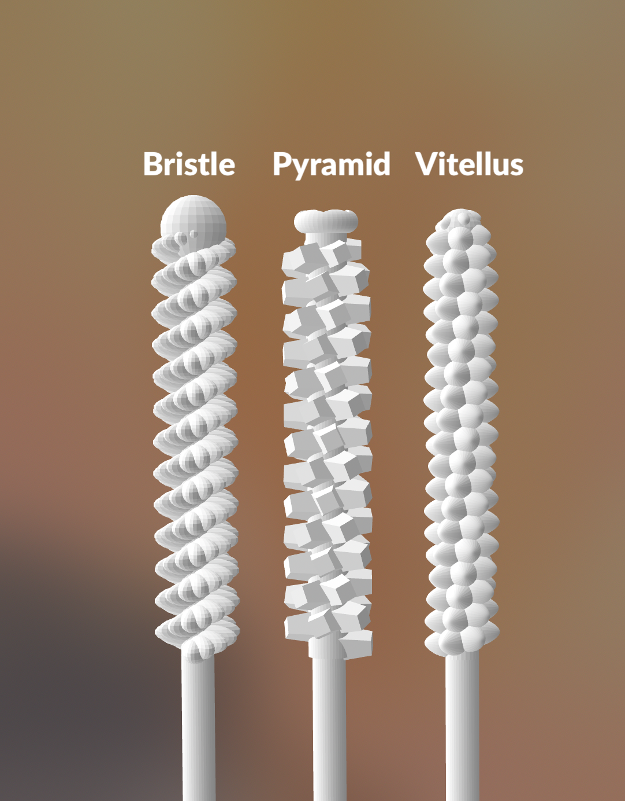
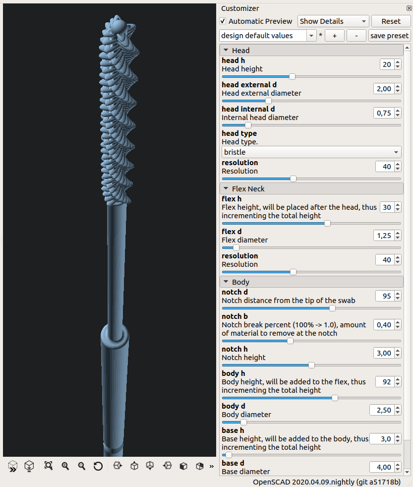

# OpenSwab - Nasopharyngeal (NP) Swab for COVID-19

[![CC BY-SA 4.0][cc-by-sa-shield]][cc-by-sa]

[Spanish Version](README.md)

## DISCLAIMER

OpenSwab was built, designed and made available in the context of a global
shortage of supplies and equipment to fight the global Coronavirus disease
(COVID-19) public health crisis. This design, along many others, is currently
being reviewed by health authorities and undergoing clinical trials.

**NEVERTHELESS, IT HASN'T BEEN FULLY TESTED, VALIDATED OR APPROVED BY ANY
ORGANIZATION. THUS, IT SHOULD BE CONSIDERED A PROTOTYPE.**

KuraLabs S.R.L is sharing these designs in goodwill with the global community
in a time of crisis to address critical gaps in the regional response and offer
an alternative method for producing urgently needed test swabs used for testing
suspected COVID-19 cases. In Consequence, KuraLabs S.R.L assumes or undertakes
**NO LIABILITY** for any direct, indirect or incidental injuries or damages
suffered as a result of the use, misuse or reliance on these test swabs and/or
the information and content on this website.

The main priority for KuraLabs S.R.L is the wellbeing of the patients. In
consequence, it is your responsibility to submit OpenSwab to the respective
approval, review and clinical trials in order to secure a license, obtain
authorization, clearance or approval from your local regulatory authority prior
the use of these swabs in medical context. By voluntarily deciding to use
and/or produce the OpenSwab designs, you assume the risk of any resulting
injury. **USE AT YOUR OWN RISK**.


## About


OpenSwab is a prototype of a Nasopharyngeal (NP) swab used to collect samples
for COVID-19 testing.

It is a thin, flexible swab, which is inserted into the nasal cavity parallel
to the bottom of the nostril until the head of the swab touches the wall of the
nasopharynx. Upon reaching the wall, small rotations are carried out so that
the swab head collects the biological material required to proceed with the
COVID-19 test.

The swabs used for COVID-19 tests cannot be made of materials such as cotton or
wood, since they affect the RNA (Ribonucleic Acid) of the sample taken.

Because of the precision and accuracy required this swab is expected to be
printed by a SLA 3D printer using biocompatible resin.

Due to the precision and accuracy required, this swab is designed to be printed
on a SLA (Stereolithography) 3D printer using heat resistant biocompatible
Class I (short-term use) ultra-violet (UV) curing resin for subsequent
sterilization in an autoclave.

At the time of this writing there is a global shortage of personal protection
equipment (PPE) and other medical supplies, including testing swabs. These
swabs were designed and created in a effort to provide a possible alternative
solution to this problem.

The intellectual property of this design is under a [CC BY-SA 4.0][cc-by-sa]
international license, so it can be used, manufactured, reproduced, modified
and commercialized freely. You can refer to the license section or contact the
OpenSwab team for more information.

<br clear="right"/>

## Photos

<p align="center">
  
</p>

<br clear="right"/>

<p align="center">
  
</p>

<br clear="right"/>

<p align="center">
  
</p>

<br clear="right"/>


## Technical Specifications

OpenSwab offers four models with different sample collection heads, named
"Bristle", "Pyramid" and "Vitellus".

<p align="center">
    
</p>

| Model               | Bristle         |  Pyramid                  | Vitellus        |
| ------------------- | --------------- |  -------------------------| ----------------|
| *Target audience*   | Adult           |  Adult                    | Adult           |
| *Use*               | Nasopharyngeal  |  Nasopharyngeal           | Nasopharyngeal  |
| *Total height*      |         145.0mm |                   145.0mm |         145.0mm |
| *Material*          | UV Resin 405nm  |  UV Resin 405nm           | UV Resin 405nm  |
| *Sterilization*     | Autoclave       |  Autoclave                | Autoclave       |
|                                                  **Head**                           |
| *Texture*           | Flake           | Truncated pyramid         | Ellipsoid       |
| *Pattern*           | Helicoidal      | Helicoidal                | Helicoidal      |
| *End*               | Spherical       | Toroid with convex star   | Spherical       |
| *Internal diameter* |           1.5mm |                     1.5mm |           1.5mm |
| *External diameter* |           4.5mm |                     4.5mm |           3.9mm |
| *Height*            |          20.0mm |                    20.0mm |          20.0mm |
|                                                  **Neck**                           |
| *Diameter*          |          1.75mm |                    1.75mm |           1.5mm |
| *Height*            |          30.0mm |                    30.0mm |          30.0mm |
|                                                  **Body**                           |
| *Diameter*          |           3.5mm |                     3.5mm |          2.75mm |
| *Height*            |          95.0mm |                    95.0mm |          95.0mm |
| *Breakpoint*        |          80.0mm |                    80.0mm |          80.0mm |

All this dimension are easily configured.
See [Product Configuration](#product-configuration) section.


## Product Features

- Break Point: At the end of the sample collection, the break point allows
  separating the part of the swab that is in charge of collecting the
  biological material to store it in the sample tube.

  The break point also works as a visual guide to indicate to medical personnel
  that they should avoid handling the swab beyond that point, both to avoid
  contamination of the sample and to prevent any type of exposure.

- Construction Material: The swabs used for COVID-19 tests cannot be made of
  materials such as cotton or wood, since they affect the RNA
  (Ribonucleic Acid) of the sample taken.

  That is why OpenSwab is designed to be printed on a SLA (Stereolithography)
  3D printer using heat resistant biocompatible Class I (short-term use)
  ultra-violet (UV) curing resin for subsequent sterilization in an autoclave.

- Anatomical design: Swab designed with a thin and flexible neck that adapts
  to the patient's nostrils, thus reducing discomfort and facilitating the
  positioning of the head of the swab in the right place by medical personnel.
  The head also has a helicoidal pattern that facilitates the introduction,
  removal and rotational action of the sample collection.

- Ergonomic design: Designed in a diameter and length suitable for handling by
  the medical personnel in charge of the test.

- Easy dimension setting: OpenSwab is designed so that the parameters of the
  swab dimensions are easily configurable as needed, which will allow to create
  a special version for children in the future.

- Ease of production: OpenSwab can be manufactured with affordable commercial
  SLA technology 3D printers such as the Anycubic Photon or Creality LD-002R.
  The length of the swab is compatible with the vast majority of these
  printers' printing area, that usually support a maximum height of 150mm.


## Fabrication

The `exports/openswab-*.stl` files contain the exported versions of 3D models
in STL format ready to be printed. The
[`exports/openswab-printable.stl`](exports/openswab-printable.stl) file
contains a grid with all 4 versions of OpenSwab if required.

The following are the *estimates* for manufacturing a batch of OpenSwabs on
some 3D printers:

### Creality LD-002R

- **Printing bed size:** *120 x 68 x 160mm*.
- **Batch size:** *12x16*.
- **Swab yield:** *72*.
- **Resin required:** *80.2ml*.
- **Printing time:** *10h38m11s*.

### Anycubic Photon

- **Printing bed size:** *120 × 68 × 150mm*.
- **Batch size:** *12x6*.
- **Swab yield:** *72*.
- **Resin required:** *80.2ml*.
- **Printing time:** *10h38m11s*.

<p align="center">
    
</p>


## Product Configuration

OpenSwab was designed in its entirety using Free Software
[OpenSCAD](https://www.openscad.org/), so the acquisition of paid Software
licenses is not required for its modification or reproduction.

The design source files are located in this repository with a `.scad`
extension. The main file is [`custom.scad`](custom.scad) and when you open it
you can easily modify all its parameters from the customizer window.

<p align="center">
    
</p>


## References

- Interim Guidelines for Collecting, Handling, and Testing Clinical Specimens
  from Persons for Coronavirus Disease 2019 (COVID-19) (2020, April 10).
  https://www.cdc.gov/coronavirus/2019-nCoV/lab/guidelines-clinical-specimens.html

- Centers for Disease Control and Prevention (CDC) Pertussis Testing Video:
  Collecting a Nasopharyngeal Swab Clinical Specimen (2020, April 10).
  https://youtu.be/zqX56LGItgQ

- How to Collect Nasopharyngeal Samples for Flu Testing (Dr. Bonner Series)
  (2020, April 10). https://youtu.be/v5A4H9q4JVA

- NETEC: COVID-19 Laboratory Specimen Collection: Nasopharyngeal Swab - Flyer
  and Validation Checklist (2020, April 10).
  https://repository.netecweb.org/items/show/894

- NETEC: COVID-19 Laboratory Specimen Collection: Nasopharyngeal Swab
  (2020, April 10). https://repository.netecweb.org/items/show/840


## License

The intellectual property of this design is under a [CC BY-SA 4.0][cc-by-sa]
international license, so it can be used, manufactured, reproduced, modified
and commercialized freely.

All derivative work must indicate "Based on OpenSwab" and a link to the website
https://github.com/kuralabs/openswab, as well as be shared under the same terms
of use.

OpenSwab was designed in its entirety using Free Software
[OpenSCAD](https://www.openscad.org/), so the acquisition of paid Software
licenses is not required for printing and modification.

KuraLabs S.R.L reserves the right to submit and pursuit for a patent grant for
any design, algorithm, shape or patentable feature that is present or derived
from the Intelectual Property (IP) submitted as part of OpenSwab. If granted,
if any, KuraLabs S.R.L guarantees that **IT WILL NOT USE** its right to enforce
such patents or seek licensing to any individual or company using any IP from
OpenSwab in any given context, including comercial use. In addition, KuraLabs
S.R.L would submit such patents to a pool of defensive patents with the
ultimate goal of improving access to medical IP in developing countries and to
help in building a robust body of prior art to protect the use of these
devices.

In this matter, KuraLabs S.R.L joins the initiative proposed by the President
of Costa Rica, President Carlos Alvarado, and the Health Minister, Daniel
Salas, in a March 23 2020 letter[[1]][presidencia-cr] to the World Health
Organization (WHO) in creating a pool of intelectual property for technologies
to detect, prevent, control and treat the COVID-19 pandemic to provide free
access or licensing on reasonable and affordable terms for all countries. Such
proposal was later supported by the WHO as stated by its General Director
Tedros Adhanom Ghebreyesus at the media briefing on April 6 2020
"Muchas gracias, Mr President. I support this proposal, and we are working with
Costa Rica to finalize the details. [...] I call on all countries, companies
and research institutions to support open data, open science and open
collaboration so that all people can enjoy the benefits of science and
research."[[2]][who-briefing]

For any inquiry related to intelectual property you may contact KuraLabs S.R.L
at info@kuralabs.io. To learn more about defensive patenting visit
https://www.defensivepatentlicense.org/

OpenSwab was designed from scratch in Costa Rica.

```
Copyright (C) 2020 KuraLabs S.R.L

You accept and agree to be bound by the terms and conditions of this
Creative Commons Attribution-ShareAlike 4.0 International Public License
("Public License"). To the extent this Public License may be interpreted as a
contract, You are granted the Licensed Rights in consideration of Your
acceptance of these terms and conditions, and the Licensor grants You such
rights in consideration of benefits the Licensor receives from making the
Licensed Material available under these terms and conditions.

    https://creativecommons.org/licenses/by-sa/4.0/

```

[![CC BY-SA 4.0][cc-by-sa-image]][cc-by-sa]

[cc-by-sa]: http://creativecommons.org/licenses/by-sa/4.0/
[cc-by-sa-image]: https://licensebuttons.net/l/by-sa/4.0/88x31.png
[cc-by-sa-shield]: https://img.shields.io/badge/License-CC%20BY--SA%204.0-lightgrey.svg
[presidencia-cr]: https://www.presidencia.go.cr/comunicados/2020/03/costa-rica-submits-proposal-for-who-to-facilitate-access-to-technologies-to-combat-covid-19/
[who-briefing]: https://www.who.int/dg/speeches/detail/who-director-general-s-opening-remarks-at-the-media-briefing-on-covid-19---6-april-2020