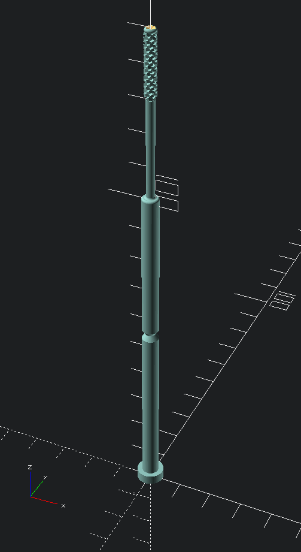

# OpenSwab - Hisopo Nasofaringeal (NP) para COVID-19

[![CC BY-SA 4.0][cc-by-sa-shield]][cc-by-sa]

[English Version](README.en.md)

## Descripción



OpenSwab es un prototipo de hisopo nasofaringeal (NP) diseñado para recolectar
muestras y realizar pruebas de COVID-19.

Es un hisopo fino y flexible, el cuál es insertado en la cavidad nasal de forma
paralela a la parte inferior de la fosa nasal hasta que la cabeza del hisopo
toque la pared de la nasofaringe. Al llegar a la pared, se procede a realizar
pequeñas rotaciones de forma que la cabeza del hisopo recolecte el material
biológico requerido para proceder a realizar la prueba COVID-19.

Los hisopos utilizados para pruebas COVID-19 no pueden estar hechos de
materiales como algodón o madera, ya que los mismos afectan el RNA de la
muestra tomada.

Debido a la precisión y exactitud requerida, se espera que este hisopo sea
impreso por una impresora 3D de tecnología SLA (Estereolitografía) utilizando
resina biocompatible.

Al momento de escribir este artículo, existe una escasez global de equipo de
protección personal y otros suministros médicos, incluidos los hisopos de
prueba. Este hisopo fue diseñado y creado en un esfuerzo por proporcionar una
posible solución a este problema.

Actualmente este prototipo está siendo revisado por autoridades de salud junto
con otros diseños. Sin embargo, no ha sido probado, validado o aprobado por
ninguna organización.


## Características del Producto

- Fácil configuración de dimensiones: OpenSwab está diseñado de forma que los
  parámetros de las dimensiones del hisopo sean fácilmente configurables según
  sea necesario.

- Diseño anatómico: Hisopo diseñado con un tamaño estándar y una cabeza que
  cumple el propósito de recoger el material de forma eficiente sin generar
  tanta incomodidad en el paciente.

- Material de Construcción: Los hisopos utilizados para pruebas COVID-19 no
  pueden estar hechos de materiales como algodón o madera, ya que los mismos
  afectan el RNA (Ácido Ribonucléico) de la muestra tomada. Es por eso que
  OpenSwab está diseñado para ser impreso en una impresora 3D de tecnología SLA
  (Estereolitografía) asegurando el uso de materiales sintéticos
  bio-compatibles y aptos su respectiva esterilización.

- Diseño ergonómico: Pensado en un diámetro y largo adecuado para su
  manipulación por parte del personal encargado de la prueba.

- Punto de Quiebre: El hisopo cuenta con un punto de quiebre que permite su
  almacenamiento en los tubos de muestra al finalizar la toma de la muestra.


## Especificaciones del Producto

A continuación se detallan las medidas predefinidas del hisopo: Cabe aclarar que
una de las ventajas de OpenSwab es que todas estas dimensiones son fácilmente
configurables. Ver sección de [Configuración del Producto](#configuracion-del-producto).

##### Cabeza del Hisopo

| Diámetro | Altura |
| -------- | -------|
| 3.5 mm   | 20 mm  |


##### Cuerpo del Hisopo

| Diámetro 1 | Diámetro 2        | Punto de Quiebre | Altura total |
| ---------- | ----------------- | ---------------- | ------------ |
| 5 mm       | Reducido a 2.5 mm | 80 mm            | 150 mm       |


## Configuración del Producto


## Imágenes del Producto


## Referencias

- Interim Guidelines for Collecting, Handling, and Testing Clinical Specimens
from Persons for Coronavirus Disease 2019 (COVID-19) (10 de abril de 2020).
https://www.cdc.gov/coronavirus/2019-nCoV/lab/guidelines-clinical-specimens.html

- Centers for Disease Control and Prevention (CDC) Pertussis Testing Video:
Collecting a Nasopharyngeal Swab Clinical Specimen (10 de abril de 2020).
https://youtu.be/zqX56LGItgQ

- How to Collect Nasopharyngeal Samples for Flu Testing (Dr. Bonner Series)
(10 de abril de 2020). https://youtu.be/v5A4H9q4JVA

- NETEC: COVID-19 Laboratory Specimen Collection: Nasopharyngeal Swab - Flyer
and Validation Checklist (10 de abril de 2020).
https://repository.netecweb.org/items/show/894

- NETEC: COVID-19 Laboratory Specimen Collection: Nasopharyngeal Swab
(10 de abril de 2020). https://repository.netecweb.org/items/show/840


## Licencia

El prototipo de OpenSwab fue diseñado en su totalidad utilizando
[OpenSCAD](https://www.openscad.org/).

Los diseños y archivos fuente de este hisopo son código abierto bajo la licencia
internacional [CC BY-SA 4.0][cc-by-sa].


[cc-by-sa]: http://creativecommons.org/licenses/by-sa/4.0/
[cc-by-sa-image]: https://licensebuttons.net/l/by-sa/4.0/88x31.png
[cc-by-sa-shield]: https://img.shields.io/badge/License-CC%20BY--SA%204.0-lightgrey.svg


```
Copyright (C) 2020 KuraLabs S.R.L

Usted acepta y acuerda estar obligado por los términos y condiciones de esta
Licencia Internacional Pública de Atribución/Reconocimiento-CompartirIgual 4.0
de Creative Commons ("Licencia Pública"). En la medida en que esta Licencia
Pública pueda ser interpretada como un contrato, a Usted se le otorgan los
Derechos Licenciados en consideración a su aceptación de estos términos y
condiciones, y el Licenciante le concede a Usted tales derechos en consideración
a los beneficios que el Licenciante recibe por poner a disposición el Material
Licenciado bajo estos términos y condiciones.

    https://creativecommons.org/licenses/by-sa/4.0/


```
[![CC BY-SA 4.0][cc-by-sa-image]][cc-by-sa]
