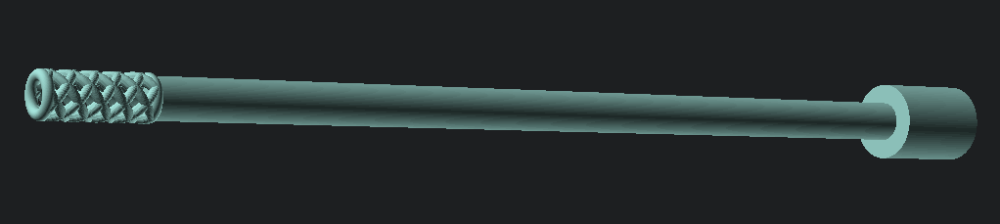

# OpenSwab - COVID-19 Swab Prototype

## About



Prototype of a nasopharyngeal (NP) swab used to collect samples for COVID-19
testing.

A NP swab is a flexible stick with a small brush at the end. The swab is
inserted in the nasal cavity to gather biological material which is held in the
brush hollow stem.

The swabs used in COVID-19 testing cannot be made of materials like cotton and
wood, that is because they would affect the RNA (Ribonucleic Acid) of the
collected sample.

Because of the precision and accuracy required this swab is expected to be
printed by a SLA 3D printer using biocompatible resin.

At the time of this writing there is a global shortage of personal protection
and other medical supplies, including testing swabs. This swab was designed and
created in a effort to provide a possible solution to this problem.

This prototype is currently being reviewed by health authorities along many
other designs. Nevertheless, it hasn't been tested, validated or approved by
any organization.

Designed using [OpenSCAD](https://www.openscad.org/). Sources of this swab are
open source under the Apache License 2.0, use and modify freely.

## License

```
Copyright (C) 2020 KuraLabs S.R.L

Licensed under the Apache License, Version 2.0 (the "License");
you may not use this file except in compliance with the License.
You may obtain a copy of the License at

   http://www.apache.org/licenses/LICENSE-2.0

Unless required by applicable law or agreed to in writing,
software distributed under the License is distributed on an
"AS IS" BASIS, WITHOUT WARRANTIES OR CONDITIONS OF ANY
KIND, either express or implied.  See the License for the
specific language governing permissions and limitations
under the License.
```
