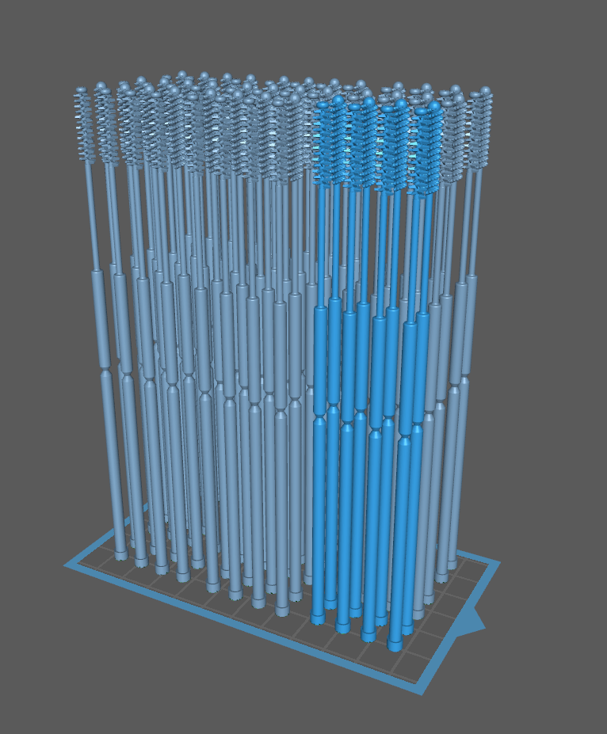

# OpenSwab - Hisopo Nasofaringeal (NP) para COVID-19

[![CC BY-SA 4.0][cc-by-sa-shield]][cc-by-sa]

[English Version](README.en.md)

[Versión en PDF](doc/OpenSwab-Rev-4-KuraLabs.pdf)

## Descargo de responsabilidad

OpenSwab fue construido, diseñado y puesto a disposición en el contexto de una
escasez global de suministros y equipos para combatir la crisis de salud
pública causada por la enfermedad por Coronavirus (COVID-19). Este diseño,
junto con muchos otros, está siendo revisado actualmente por las autoridades
sanitarias y está siendo sometido a ensayos clínicos.

**SIN EMBARGO, NO HA SIDO PROBADO, VALIDADO O APROBADO TOTALMENTE POR NINGUNA
ORGANIZACIÓN. POR LO TANTO, DEBE SER CONSIDERADO UN PROTOTIPO.**

KuraLabs S.R.L comparte estos diseños en buena voluntad con la comunidad global
en un momento de crisis con el fin de enfrentar las brechas en la respuesta
regional y ofrecer un método alternativo para producir hisopos de prueba
necesarios utilizados para probar casos sospechosos de COVID-19 que están
siendo requeridos con urgencia. En consecuencia, KuraLabs S.R.L no asume
**NINGUNA RESPONSABILIDAD** por las lesiones o daños directos, indirectos o
incidentales sufridos como resultado del uso, mal uso o dependencia de estos
hisopos de prueba y/o de la información y el contenido de este sitio web.

La principal prioridad para KuraLabs S.R.L es el bienestar de los pacientes. En
consecuencia, es responsabilidad de quien quiera utilizar OpenSwab de enviarlo
para su aprobación, revisión y ensayos clínicos respectivos con el fin de
obtener una licencia, autorización o aprobación por parte de su autoridad
reguladora local antes de usar estos hisopos en el contexto médico. Al decidir
voluntariamente usar y/o producir los diseños de OpenSwab, usted asume el
riesgo de cualquier lesión resultante. **ÚSELO BAJO SU PROPIO RIESGO**.


## Descripción


OpenSwab es un prototipo de hisopo nasofaringeal (NP) diseñado para recolectar
muestras y realizar pruebas de COVID-19.

Es un hisopo fino y flexible, el cual es insertado en la cavidad nasal de forma
paralela a la parte inferior de la fosa nasal hasta que la cabeza del hisopo
toque la pared de la nasofaringe. Al llegar a la pared, se procede a realizar
pequeñas rotaciones de forma que la cabeza del hisopo recolecte el material
biológico requerido para proceder a realizar la prueba COVID-19.

Los hisopos utilizados para pruebas COVID-19 no pueden estar hechos de
materiales como algodón o madera, ya que los mismos afectan el ARN de la
muestra tomada.

Debido a la precisión y exactitud requerida, este hisopo fue diseñado para ser
impreso por una impresora 3D de tecnología SLA (Estereolitografía) utilizando
resina de curado ultravioleta (UV) biocompatible de Clase I (uso de corto plazo)
resistente al calor para su posterior esterilización en un autoclave.

Al momento de escribir este artículo, existe una escasez global de equipo de
protección personal y otros suministros médicos, incluidos los hisopos de
prueba. Estos hisopos fueron diseñados y creados en un esfuerzo por
proporcionar una posible solución alternativa a este problema.

La propiedad intelectual de este diseño se encuentra bajo una licencia
[CC BY-SA 4.0][cc-by-sa] por lo que puede ser utilizado, producido, modificado
y comercializado libremente. Puede referirse a la sección de licencia o
contactar al equipo de OpenSwab para más información.

<br clear="right"/>


## Especificaciones Técnicas

OpenSwab ofrece cuatro modelos con diferentes versiones de cabeza para la
recolección de muestras, denominadas "Bristle", "Pyramid", "Vitellus".

<p align="center">
    
</p>


| Modelo             | Bristle         | Pyramid                      | Vitellus        |
| ------------------ | --------------- | -----------------------------| ----------------|
| *Público meta*     | Adulto          | Adulto                       | Adulto          |
| *Uso*              | Nasofaringeal   | Nasofaringeal                | Nasofaringeal   |
| *Altura total*     |         145.0mm |                      145.0mm |         145.0mm |
| *Material*         | Resina UV 405nm | Resina UV 405nm              | Resina UV 405nm |
| *Esterilización*   | Autoclave       | Autoclave                    | Autoclave       |
|                                               **Cabeza**                              |
| *Textura*          | Hojuela         | Pirámide truncada            | Elipsoide       |
| *Patrón*           | Helicoidal      | Helicoidal                   | Helicoidal      |
| *Terminación*      | Esférica        | Toroide con estrella convexa | Esférica        |
| *Diámetro interno* |           1.5mm |                       1.85mm |           1.5mm |
| *Diámetro externo* |           3.9mm |                        3.9mm |           3.9mm |
| *Largo*            |          20.0mm |                       20.0mm |          20.0mm |
|                                            **Cuello flexible**                        |
| *Diámetro*         |           1.5mm |                        1.5mm |           1.5mm |
| *Largo*            |          30.0mm |                       30.0mm |          30.0mm |
|                                               **Cuerpo**                              |
| *Diámetro*         |          2.75mm |                       2.75mm |          2.75mm |
| *Largo*            |          95.0mm |                       95.0mm |          95.0mm |
| *Punto de quiebre* |          80.0mm |                       80.0mm |          80.0mm |

Todas estas dimensiones son fácilmente configurables.
Ver sección de [Configuración del Producto](#configuracion-del-producto).


## Características del Producto

- Punto de Quiebre: Al finalizar la toma de la muestra, el punto de quiebre
  permite separar la parte del hisopo que se encarga de la recolección del
  material biológico para así almacenarla en el tubo de muestra.

  El punto de quiebre también funciona como guía visual para indicarle al
  personal médico que debe evitar manipular el hisopo pasando el mismo, tanto
  para evitar la contaminación de la muestra como para prevenir cualquier tipo
  de exposición.

- Material de Construcción: Los hisopos utilizados para pruebas COVID-19 no
  pueden estar hechos de materiales como algodón o madera, ya que los mismos
  afectan el ARN (Ácido Ribonucléico) de la muestra tomada.

  Es por eso que OpenSwab está diseñado para ser impreso en una impresora 3D de
  tecnología SLA (Estereolitografía) utilizando resina de curado ultravioleta
  (UV) biocompatible de Clase I (uso de corto plazo) resistente al calor para
  su posterior esterilización en un autoclave.

- Diseño anatómico: Hisopo diseñado con un cuello delgado y flexible que se
  adapta a las fosas nasales del paciente por lo que se reduce el malestar y
  facilita el posicionamiento de la cabeza en el lugar adecuado por parte del
  personal médico. La cabeza cuenta además con un patrón helicoidal que
  facilita la introducción, el retiro y la acción giratoria propia del frotis.

- Diseño ergonómico: Pensado en un diámetro y largo adecuado para su
  manipulación por parte del personal encargado de la prueba.

- Fácil configuración de dimensiones: OpenSwab está diseñado de forma que los
  parámetros de las dimensiones del hisopo sean fácilmente configurables según
  sea necesario, lo que permitirá en el futuro crear una versión especial para
  niños y niñas.

- Facilidad de producción: OpenSwab puede fabricarse con impresoras 3D de
  tecnología SLA comerciales accesibles como la Anycubic Photon o la Creality
  LD-002R. El largo del hisopo es compatible con la gran mayoría del área de
  impresión de éstas impresoras, que normalmente soportan un máximo de 150mm de
  altura.


## Fabricación

Los archivos `exports/openswab-*.stl` contienen las versiones exportadas de los
modelos 3D en formato STL listos para ser impresos. El archivo
[`exports/openswab-printable.stl`](exports/openswab-printable.stl) contiene
un arreglo con las 4 versiones de OpenSwab en caso de ser requerido.

Las *estimaciones* de fabricación de un lote de OpenSwabs en diferentes
impresoras 3D se listan a continuación:

### Creality LD-002R

- **Tamaño de cama de impresión:** *120 x 68 x 160mm*.
- **Tamaño del lote:** *12x16*.
- **Cantidad de hisopos producidos:** *72*.
- **Recina requerida:** *80.2ml*.
- **Tiempo de impresión:** *10h38m11s*.

### Anycubic Photon

- **Tamaño de cama de impresión:** *120 × 68 × 150mm*.
- **Tamaño del lote:** *12x16*.
- **Cantidad de hisopos producidos:** *72*.
- **Recina requerida:** *80.2ml*.
- **Tiempo de impresión:** *10h38m11s*.

<p align="center">
    
</p>


## Configuración del Producto

OpenSwab fue diseñado en su totalidad utilizando el Software Libre
[OpenSCAD](https://www.openscad.org/), por lo que para su modificación o
reproducción no se requiere de la adquisición de licencias de Software de pago.

El archivos fuente de los diseños se encuentra en este repositorio con una
extensión `.scad`. El archivo principal es [`custom.scad`](custom.scad) y al
abrirlo se pueden modificar todos los parámetros del mismo fácilmente desde la
ventana del customizador.

<p align="center">
    
</p>


## Referencias

- Interim Guidelines for Collecting, Handling, and Testing Clinical Specimens
  from Persons for Coronavirus Disease 2019 (COVID-19) (10 de abril de 2020).
  https://www.cdc.gov/coronavirus/2019-nCoV/lab/guidelines-clinical-specimens.html

- Centers for Disease Control and Prevention (CDC) Pertussis Testing Video:
  Collecting a Nasopharyngeal Swab Clinical Specimen (10 de abril de 2020).
  https://youtu.be/zqX56LGItgQ

- How to Collect Nasopharyngeal Samples for Flu Testing (Dr. Bonner Series)
  (10 de abril de 2020). https://youtu.be/v5A4H9q4JVA

- NETEC: COVID-19 Laboratory Specimen Collection: Nasopharyngeal Swab - Flyer
  and Validation Checklist (10 de abril de 2020).
  https://repository.netecweb.org/items/show/894

- NETEC: COVID-19 Laboratory Specimen Collection: Nasopharyngeal Swab
  (10 de abril de 2020). https://repository.netecweb.org/items/show/840


## Licencia

La propiedad intelectual de este diseño se encuentra bajo una licencia
internacional [CC BY-SA 4.0][cc-by-sa] por lo que puede ser utilizado,
fabricado, reproducido, modificado y comercializado libremente.

Todo trabajo derivado debe indicar "Basado en OpenSwab" y un link al sitio web
https://github.com/kuralabs/openswab, así como ser compartido bajo los mismos
términos de uso.

OpenSwab fue diseñado en su totalidad utilizando el Software Libre
[OpenSCAD](https://www.openscad.org/), por lo que para su impresión y
modificación no se requiere de la adquisición de licencias de Software de pago.

KuraLabs S.R.L se reserva el derecho de presentar y solicitar una patente para
cualquier diseño, algoritmo, forma o característica patentable que esté
presente o se derive de la Propiedad Intelectual (PI) presentada como parte de
OpenSwab. Si se concede, si corresponde, KuraLabs S.R.L garantiza que
**NO UTILIZARÁ** su derecho de hacer cumplir tales patentes o solicitar
licencias a cualquier persona o empresa que utilice cualquier PI de OpenSwab en
cualquier contexto, incluido el uso comercial. Además, KuraLabs S.R.L
presentaría dichas patentes a un repositorio de patentes defensivas con el
objetivo final de mejorar el acceso a la PI médica en los países en desarrollo
y ayudar a construir una robusta colección de arte previo para proteger el uso
de estos dispositivos.

En este contexto, KuraLabs SRL se une a la iniciativa propuesta por el
Presidente de Costa Rica, el Presidente Carlos Alvarado, y el Ministro de
Salud, Daniel Salas, plasmada en una carta enviada el 23 de marzo de
2020[[1]][presidencia-cr] a la Organización Mundial de la Salud (OMS) para
crear un repositorio de propiedad intelectual de tecnologías para la detección,
prevención, control y tratamiento de la pandemia del COVID-19 con el fin de
proporcionar acceso gratuito o licencias en términos razonables y accesibles
para todos los países. Dicha propuesta fue apoyada posteriormente por la OMS,
como lo declaró su Director General Tedros Adhanom Ghebreyesus en la
conferencia de prensa del 6 de abril de 2020 "Muchas gracias, señor Presidente.
Apoyo esta propuesta, y estamos trabajando con Costa Rica para finalizar los
detalles. [...] Pido a todos los países, empresas e instituciones de
investigación que apoyen los datos abiertos, la ciencia abierta y la
colaboración abierta para que todas las personas puedan disfrutar de los
beneficios de la ciencia y la investigación".[[2]][who-briefing]

OpenSwab fue diseñado desde cero en Costa Rica.

```
Copyright (C) 2020 KuraLabs S.R.L

Usted acepta y acuerda estar obligado por los términos y condiciones de esta
Licencia Internacional Pública de Atribución/Reconocimiento-CompartirIgual 4.0
de Creative Commons ("Licencia Pública"). En la medida en que esta Licencia
Pública pueda ser interpretada como un contrato, a Usted se le otorgan los
Derechos Licenciados en consideración a su aceptación de estos términos y
condiciones, y el Licenciante le concede a Usted tales derechos en consideración
a los beneficios que el Licenciante recibe por poner a disposición el Material
Licenciado bajo estos términos y condiciones.

    https://creativecommons.org/licenses/by-sa/4.0/

```

[![CC BY-SA 4.0][cc-by-sa-image]][cc-by-sa]

[cc-by-sa]: http://creativecommons.org/licenses/by-sa/4.0/
[cc-by-sa-image]: https://licensebuttons.net/l/by-sa/4.0/88x31.png
[cc-by-sa-shield]: https://img.shields.io/badge/License-CC%20BY--SA%204.0-lightgrey.svg
[presidencia-cr]: https://www.presidencia.go.cr/comunicados/2020/03/costa-rica-submits-proposal-for-who-to-facilitate-access-to-technologies-to-combat-covid-19/
[who-briefing]: https://www.who.int/dg/speeches/detail/who-director-general-s-opening-remarks-at-the-media-briefing-on-covid-19---6-april-2020
